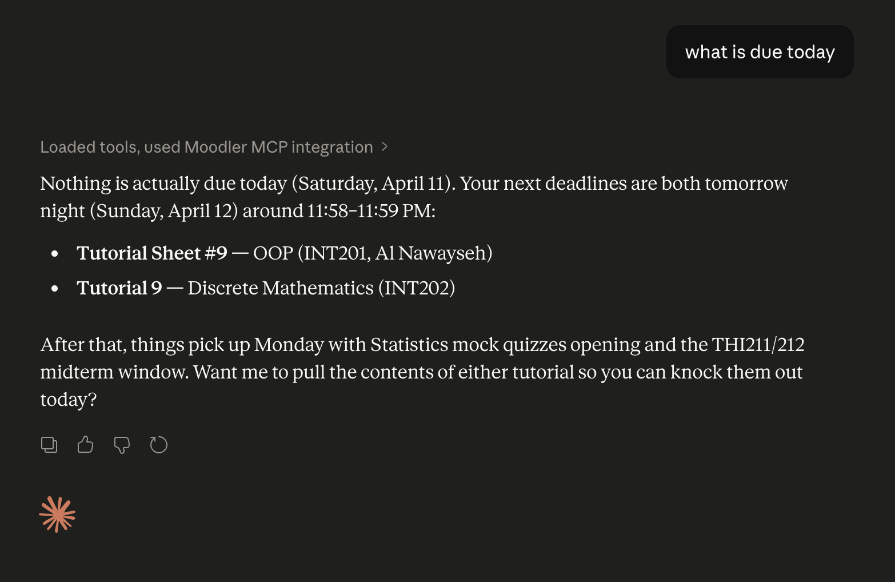

<p align="center">
  
</p>

<p align="center">
  <em>Talk to your Moodle in plain English.</em>
</p>

<p align="center">
  <a href="https://github.com/GhaithAlHallak8/moodler-mcp/releases"></a>
  <a href="LICENSE"></a>
  
</p>

---

**moodler-mcp** is an open-source MCP server that plugs your Moodle account into [Claude Desktop](https://claude.ai/download) (or any MCP-compatible AI assistant). Once installed, you can stop wrestling with Moodle's UI and just ask questions in natural language.

Built in Python, [MIT](LICENSE) licensed, distributed as a one-click `.mcpb` bundle.

## What you can do with it

<p align="center">
  
</p>

A few real queries it handles:

- *"What's due this week?"* → pulls from your calendar and assignment list
- *"What do I need to do for my THI212 project?"* → reads the assignment page and returns the full spec
- *"Why are my grades in INT201 low?"* → scrapes your user grade report and summarises what's posted
- *"Download the week 4 lecture slides and summarise them."* → fetches the PDF through Moodle's resource redirect chain and reads it directly (PDFs and all)

It handles courses, assignments, deadlines, grades, feedback, file downloads, and — for staff accounts — assignment participant lookups and student search. The full tool list is [below](#tools).

## Install

### Prerequisites

Both install paths need [`uv`](https://docs.astral.sh/uv/) on your machine — it'll fetch Python 3.14 for you on first run.

```bash
# macOS / Linux
curl -LsSf https://astral.sh/uv/install.sh | sh
```

```powershell
# Windows (PowerShell)
powershell -ExecutionPolicy ByPass -c "irm https://astral.sh/uv/install.ps1 | iex"
```

### Option 1: One-click bundle (recommended)

1. Grab `moodler-mcp.mcpb` from the [latest release](https://github.com/GhaithAlHallak8/moodler-mcp/releases).
2. Double-click the file (or drag it into Claude Desktop's extensions view).
3. When prompted, enter the base URL of your Moodle instance (e.g. `https://mylms.example.edu`, no trailing slash).
4. Start a new conversation. The first time you ask anything Moodle-related, a Chromium window will open so you can complete single sign-on — that's a one-time step.

That's it. Your session stays cached locally until it expires.

### Option 2: From source

```bash
git clone https://github.com/GhaithAlHallak8/moodler-mcp.git
cd moodler-mcp
uv sync
export MOODLE_URL=https://mylms.example.edu
uv run python -m moodler_mcp
```

To wire it into Claude Desktop manually, add to `claude_desktop_config.json`:

```json
{
  "mcpServers": {
    "moodler-mcp": {
      "command": "uv",
      "args": ["--directory", "/absolute/path/to/moodler-mcp", "run", "python", "-m", "moodler_mcp"],
      "env": {
        "MOODLE_URL": "https://mylms.example.edu"
      }
    }
  }
}
```

## How authentication actually works

> **No API tokens. No institutional paperwork. No `MOODLE_API_TOKEN`.**

moodler-mcp does **not** use Moodle's public Web Services REST API. Instead, it drives a real browser session — the same way you log in from your laptop:

1. On first run, it launches a headless Chromium via [Playwright](https://playwright.dev/python/) and navigates to `${MOODLE_URL}/my/`.
2. If it can't find a valid session, it re-opens the browser in **headed mode** so you can complete your institution's SSO flow (SAML, Azure AD, whatever your IdP is).
3. Once you're logged in, it extracts the `MoodleSession` cookie and scrapes the `sesskey` from the dashboard HTML, then saves both to `~/.moodler-mcp/browser_state.json`.
4. Subsequent calls reuse that session headlessly, authenticating against Moodle's internal AJAX endpoint (`/lib/ajax/service.php`) — the same endpoint the Moodle web UI uses.
5. If the session expires (the Moodle returns `servicerequireslogin` or redirects to `/login/`), the cookie is cleared and the flow re-runs once.

This means two things:

- **It works anywhere your student account works.** If you can log into Moodle in a browser, moodler-mcp can too. No permissions to request, no admin to email.
- **It fails gracefully.** Session drift is automatically recovered on the next call.

## Configuration

| Variable | Required | Default | Description |
|---|---|---|---|
| `MOODLE_URL` | ✅ | _(none)_ | Base URL of your Moodle instance, no trailing slash. Example: `https://mylms.example.edu` |
| `MOODLER_CACHE_DISABLED` | ❌ | _unset_ | Set to `1` to disable the local SQLite cache. |

## Where state lives

All local state is under `~/.moodler-mcp/`:

- `browser_state.json` — Playwright storage state (your cached Moodle session cookie).
- `cache.db` — SQLite cache of Moodle API responses. See [caching](#caching).
- `downloads/` — files fetched by `download_resource`. Exposed back to the MCP client as `downloads:///{filename}` resources.

Delete the directory to wipe everything.

## Caching

Moodle reads go through a small SQLite-backed cache so repeated tool calls return instantly. TTLs are per-operation:

| Data | TTL |
|---|---|
| Enrolled course list | 1 day |
| Course sections | 1 hour |
| Calendar / deadlines | 30 min |
| Assignment participants | 10 min |
| Assignment view / status | 10 min |
| Course module metadata | 1 day |
| Grade report HTML | 5 min |
| Student search | 15 min |

Disable with `MOODLER_CACHE_DISABLED=1`, or call the `clear_cache` tool to wipe all or part of the cache (`clear_cache(pattern="get_grade_report_html")` to target a subset).

Broken cache reads never fail a tool call — corruption or disk errors are logged and treated as a cache miss.

## Tools

| Tool | For | Description |
|---|---|---|
| `list_courses` | Students | List your enrolled Moodle courses. |
| `get_course_contents` | Students | Get all sections, activities, and resources in a course. |
| `get_module_content` | Students | Read any Moodle module page (assignment, folder, URL, page). |
| `download_resource` | Students | Download a Moodle file (PDF, DOCX, PPTX…) and return its content. |
| `read_downloaded_file` | Students | Re-read a previously downloaded file from the local cache. |
| `get_course_deadlines` | Students | List all assignments, quizzes, and deadlines for a course. |
| `get_upcoming_deadlines` | Students | Upcoming deadlines across all courses, sorted by date. |
| `get_assignment_feedback` | Students | Your submission status, grade, and feedback for an assignment. |
| `get_course_grades` | Students | Scrape your user grade report for a specific course. |
| `get_assignment_participants` | Instructors | List students submitting to an assignment, with status. |
| `get_assignment_participant_detail` | Instructors | Detailed submission info for one student on one assignment. |
| `search_students` | Instructors | Search students enrolled in a course by name. |
| `clear_cache` | All | Clear the local SQLite cache, optionally matching a substring. |

### For instructors (experimental)

The teacher-facing tools (`get_assignment_participants`, `get_assignment_participant_detail`, `search_students`) work but have had significantly less real-world testing than the student-facing flows. Expect rough edges and please [open an issue](https://github.com/GhaithAlHallak8/moodler-mcp/issues) if something breaks — traceback + the AJAX method that failed is enough.

## Privacy

moodler-mcp runs entirely on your machine. It connects only to your Moodle instance and to your AI assistant. No telemetry, no analytics, no outbound connections to any third party. Your Moodle session cookie is stored locally in `~/.moodler-mcp/browser_state.json` and nowhere else. See [PRIVACY.md](PRIVACY.md) for the full statement.

## Contributing

PRs welcome. See [CONTRIBUTING.md](CONTRIBUTING.md) for the fork-and-PR workflow, local setup (`uv sync` + `pre-commit`), and conventional-commit PR title rules (release-please reads them to cut releases).

## License

[MIT](LICENSE) © Ghaith AlHallak
