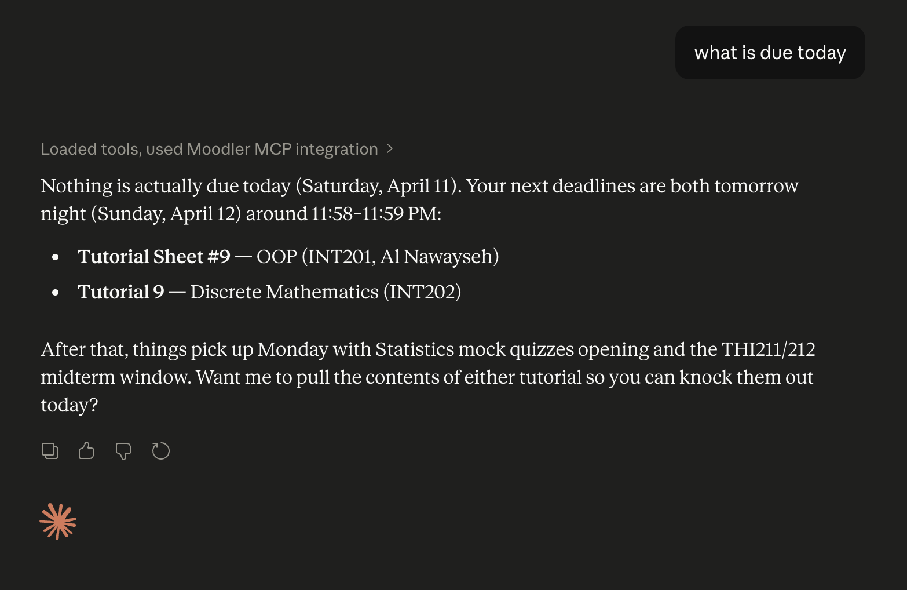

<p align="center">
  
</p>

<p align="center">
  <em>Talk to your Moodle in plain English.</em>
</p>

<p align="center">
  <a href="https://github.com/GhaithAlHallak8/moodler-mcp/releases"></a>
  <a href="LICENSE"></a>
  
</p>

---

**moodler-mcp** is an open-source MCP server that plugs your Moodle account into [Claude Desktop](https://claude.ai/download), Claude Code, ChatGPT desktop or any MCP-compatible AI assistant. Once installed, you can stop wrestling with Moodle's UI and just ask questions in natural language.

Built in Python, [MIT](LICENSE) licensed, distributed as a one-click `.mcpb` bundle.

## What you can do with it

<p align="center">
  
</p>

A few real queries it handles:

- _"What's due this week?"_ → pulls from your calendar and assignment list
- _"What do I need to do for my THI212 project?"_ → reads the assignment page and returns the full spec
- _"Why are my grades in INT201 low?"_ → scrapes your user grade report and summarises what's posted
- _"Download the week 4 lecture slides and summarise them."_ → fetches the PDF through Moodle's resource redirect chain and reads it directly (PDFs and all)

It handles courses, assignments, deadlines, grades, feedback, file downloads, and — for staff accounts — assignment participant lookups and student search. The full tool list is [below](#tools).

## Disclaimer

**moodler-mcp is an unofficial, independent project. It is not affiliated with, endorsed by, or sponsored by Moodle Pty Ltd or any educational institution.**

### Intended use

This tool is built to help students and instructors interact with their own Moodle account more efficiently — checking deadlines, reviewing course materials, tracking grades, and organizing coursework through an AI assistant.

### Not intended for

- **Academic dishonesty of any kind.** This includes using an LLM to generate answers for quizzes, assignments, or exams accessed through this tool, submitting AI-generated work as your own, or any activity that violates your institution's academic integrity policy. The tool exposes your coursework to an AI — what you do with that access is your responsibility, and misuse can have serious consequences (failing grades, suspension, expulsion).
- **Any use that violates your institution's Moodle terms of service.**

## Install

### Prerequisites

Both install paths need [`uv`](https://docs.astral.sh/uv/) on your machine — it'll fetch Python 3.14 for you on first run.

```bash
# macOS / Linux
curl -LsSf https://astral.sh/uv/install.sh | sh
```

```powershell
# Windows (PowerShell)
powershell -ExecutionPolicy ByPass -c "irm https://astral.sh/uv/install.ps1 | iex"
```

### Option 1: One-click bundle (recommended)

1. Grab `moodler-mcp.mcpb` from the [latest release](https://github.com/GhaithAlHallak8/moodler-mcp/releases).
2. Double-click the file (or drag it into Claude Desktop's extensions view).
3. When prompted, enter the base URL of your Moodle instance (e.g. `https://mylms.example.edu`, no trailing slash).
4. Start a new conversation and ask Claude to sign in to Moodle (or just ask a Moodle question; the tool will tell Claude to run `login_to_moodle`). A browser window opens once so you can complete single sign-on.

That's it. The resulting token is stored locally and stays valid until you revoke it.

### Option 2: From source

```bash
git clone https://github.com/GhaithAlHallak8/moodler-mcp.git
cd moodler-mcp
uv sync
export MOODLE_URL=https://mylms.example.edu
uv run python -m moodler_mcp
```

To wire it into Claude Desktop manually, add to `claude_desktop_config.json`:

```json
{
  "mcpServers": {
    "moodler-mcp": {
      "command": "uv",
      "args": ["--directory", "/absolute/path/to/moodler-mcp", "run", "python", "-m", "moodler_mcp"],
      "env": {
        "MOODLE_URL": "https://mylms.example.edu"
      }
    }
  }
}
```

### Option 3: ChatGPT desktop or Codex

ChatGPT's desktop app and Codex CLI share `~/.codex/config.toml`. Add:

```toml
[mcp_servers.moodler]
command = "uv"
args = ["run", "--project", "/absolute/path/to/moodler-mcp", "python", "-m", "moodler_mcp"]
env_vars = ["MOODLE_URL"]
```

Set `MOODLE_URL` in your shell environment. ChatGPT on the web does not read this file.

## How authentication works

> **No API tokens to request. No institutional paperwork.**

The first time you use any tool, it tells you to run `login_to_moodle`. That tool opens a browser window (your installed Chrome, or Playwright's Chromium) on your Moodle dashboard. Complete single sign-on as usual. moodler-mcp then asks Moodle for a mobile-app web service token, the same kind the official Moodle app uses, and stores it in `~/.moodler-mcp/token.json` with owner-only permissions. The browser closes and is never opened again.

Every tool afterwards calls Moodle's REST web service with that token. No cookies, no session key, no HTML scraping. Pages that only exist as HTML use a one-off autologin key that Moodle rate-limits to one per six minutes.

The token stays valid until you reset it under Moodle's **Security keys** page or an administrator sets a token lifetime. If it is revoked, tools report that you are not signed in and you run `login_to_moodle` again.

This means it works anywhere your account works: if your institution has the Moodle mobile app enabled (almost all do), no permissions need to be requested and no admin needs to be emailed.

## Configuration

| Variable                        | Required | Default  | Description                                                                                                                                                     |
| ------------------------------- | -------- | -------- | --------------------------------------------------------------------------------------------------------------------------------------------------------------- |
| `MOODLE_URL`                    | ✅       | _(none)_ | Base URL of your Moodle instance, no trailing slash. Example: `https://mylms.example.edu`                                                                       |
| `MOODLER_ALLOW_STUDENT_WRITES`  | ❌       | off      | Registers `submit_assignment`, `post_forum_reply`, `reply_to_conversation`, `mark_notifications_read`, `mark_activity_complete`, `create_calendar_event`.       |
| `MOODLER_ALLOW_TEACHER_GRADING` | ❌       | off      | Registers `save_assignment_grade` and `grant_extension`.                                                                                                        |
| `MOODLER_CACHE_DISABLED`        | ❌       | _unset_  | Set to `1` to disable the local SQLite cache.                                                                                                                   |

Flags accept `1`, `true` or `yes`. Tools behind a disabled flag are not registered at all, so your assistant never sees them. Destructive writes ask for confirmation (an approval prompt on clients that support it, otherwise an explicit `confirm=true` argument).

## Where state lives

All local state is under `~/.moodler-mcp/`:

- `token.json` — your Moodle web service token and private token, owner-readable only.
- `cache.db` — SQLite cache of Moodle API responses. See [caching](#caching).
- `downloads/` — files fetched by `download_resource`. Exposed back to the MCP client as `downloads://<filename>` resources.

Delete the directory to wipe everything.

## Caching

Moodle reads go through a small SQLite-backed cache so repeated tool calls return instantly. TTLs are per-operation:

| Data                              | TTL    |
| --------------------------------- | ------ |
| Enrolled course list              | 1 day  |
| Course contents                   | 1 hour |
| Module, page, url, folder lookups | 1 day  |
| Calendar / deadlines              | 30 min |
| Assignments, submissions, grades  | 10 min |
| Grade report, grade overview      | 5 min  |
| Forums, quizzes                   | 1 hour |
| Discussions, attempts, completion | 5 min  |
| Notifications, conversations      | 1 min  |
| Student search, roster            | 15 min |

Disable with `MOODLER_CACHE_DISABLED=1`, or call the `clear_cache` tool to wipe all or part of the cache (`clear_cache(pattern="grades_table")` to target a subset).

Broken cache reads never fail a tool call — corruption or disk errors are logged and treated as a cache miss.

## Tools

Every data tool returns a one-line summary plus structured content matching a declared output schema.

### Reading

| Tool                                | For         | Description                                                                 |
| ----------------------------------- | ----------- | --------------------------------------------------------------------------- |
| `login_to_moodle`                   | All         | One-time browser sign-in that stores the web service token.                 |
| `list_courses`                      | Students    | List your enrolled Moodle courses.                                          |
| `get_course_contents`               | Students    | Sections, activities and files in a course, with cmids and file URLs.       |
| `get_module_content`                | Students    | One module: assignment brief and attachments, page text, URL, folder files. |
| `download_resource`                 | Students    | Download a file and return its content, local path and resource link.       |
| `read_downloaded_file`              | Students    | Read a file extracted from a downloaded zip.                                |
| `list_assignments`                  | Students    | Assignments in a course with due dates, brief and attachments.              |
| `get_course_deadlines`              | Students    | Deadlines for a course.                                                     |
| `get_upcoming_deadlines`            | Students    | Upcoming deadlines across all courses.                                      |
| `get_assignment_feedback`           | Students    | Your submission status, grade and feedback for an assignment.               |
| `get_course_grades`                 | Students    | Your grade report for a course.                                             |
| `get_grade_overview`                | Students    | Your final grade in every course.                                           |
| `get_notifications`                 | Students    | Moodle notifications.                                                       |
| `list_conversations`                | Students    | Your message conversations.                                                 |
| `get_conversation`                  | Students    | Messages in one conversation.                                               |
| `list_forums`                       | Students    | Forums in a course.                                                         |
| `list_discussions`                  | Students    | Discussions in a forum.                                                     |
| `get_discussion`                    | Students    | Posts in a discussion, with attachments.                                    |
| `list_quizzes`                      | Students    | Quizzes in a course.                                                        |
| `get_quiz_attempts`                 | Students    | Your quiz attempts and best grade.                                          |
| `get_quiz_attempt_review`           | Students    | Review of a finished attempt.                                               |
| `get_completion_status`             | Students    | Activity and course completion.                                             |
| `get_calendar`                      | Students    | All calendar events in a month.                                             |
| `get_calendar_upcoming`             | Students    | Upcoming calendar events.                                                   |
| `get_grading_summary`               | Instructors | Submission and grading counts for an assignment.                            |
| `get_grading_table`                 | Instructors | One row per participant with status and grade.                              |
| `get_assignment_participants`       | Instructors | Participants of an assignment with submission flags.                        |
| `get_assignment_participant_detail` | Instructors | One participant's submission details.                                       |
| `search_students`                   | Instructors | Search enrolled users by name or email.                                     |
| `get_course_roster`                 | Instructors | Every enrolled user with roles and groups.                                  |
| `get_grade_items`                   | Instructors | Gradebook items in a course.                                                |
| `clear_cache`                       | All         | Clear the local SQLite cache, optionally matching a substring.              |

### Writes (off by default)

| Tool                      | Flag                            | Description                                                          |
| ------------------------- | ------------------------------- | -------------------------------------------------------------------- |
| `submit_assignment`       | `MOODLER_ALLOW_STUDENT_WRITES`  | Upload a file as your submission and submit it for grading.          |
| `post_forum_reply`        | `MOODLER_ALLOW_STUDENT_WRITES`  | Reply to a forum post.                                               |
| `reply_to_conversation`   | `MOODLER_ALLOW_STUDENT_WRITES`  | Send a message in an existing conversation.                          |
| `mark_notifications_read` | `MOODLER_ALLOW_STUDENT_WRITES`  | Mark all notifications read.                                         |
| `mark_activity_complete`  | `MOODLER_ALLOW_STUDENT_WRITES`  | Tick or untick an activity's completion box.                         |
| `create_calendar_event`   | `MOODLER_ALLOW_STUDENT_WRITES`  | Create a personal calendar event.                                    |
| `save_assignment_grade`   | `MOODLER_ALLOW_TEACHER_GRADING` | Record a grade and feedback comment for one student.                 |
| `grant_extension`         | `MOODLER_ALLOW_TEACHER_GRADING` | Grant a due-date extension to one student.                           |

Quiz attempts, deletions and identity reveals are deliberately not exposed.

### For instructors (experimental)

The teacher-facing tools work but have had significantly less real-world testing than the student-facing flows. Expect rough edges and please [open an issue](https://github.com/GhaithAlHallak8/moodler-mcp/issues) if something breaks — the error text names the Moodle web service function that failed.

## Privacy

moodler-mcp runs entirely on your machine. It connects only to your Moodle instance and to your AI assistant. No telemetry, no analytics, no outbound connections to any third party. Your Moodle web service token is stored locally in `~/.moodler-mcp/token.json` and nowhere else. See [PRIVACY.md](PRIVACY.md) for the full statement.

## Contributing

PRs welcome. See [CONTRIBUTING.md](CONTRIBUTING.md) for the fork-and-PR workflow, local setup (`uv sync` + `pre-commit`), and conventional-commit PR title rules (release-please reads them to cut releases).

## License

[MIT](LICENSE) © Ghaith AlHallak
